# Sept 25 : 

Ok so for my nfc card today i started the work , i chose `NT3H2111` this ic for my work , i think i will use the eeprom for nfc on my card and i2c for rewrittin when needed , ik i can use the nfc for rewrittin but why tht when i can just use i2c .

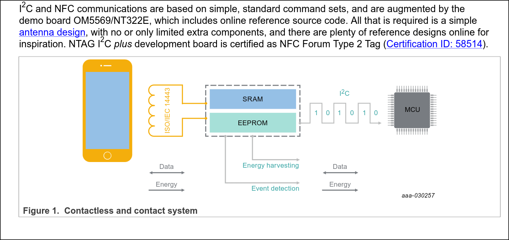

 2 kb is far more than enough for storing just some links , like my portfolio , my github or even my phone num also i can use it as a card access if i use rfid sensors later but thts upto the later me not now at all so why worry? 

 Oh so its a sot902 qfn not a prob for me i have got hot air hehe .

 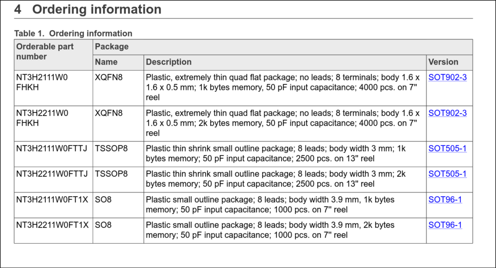

 Lol too bad for windows users but i use arch btw with easyeda2kicad from yay i got the footprints and symbols of lcsc , but as i am kind guy , i will tag those in my repo .

Wait i just realized its qfn even with a hot air its hard , oh its hard bring it on i will do it mysef .

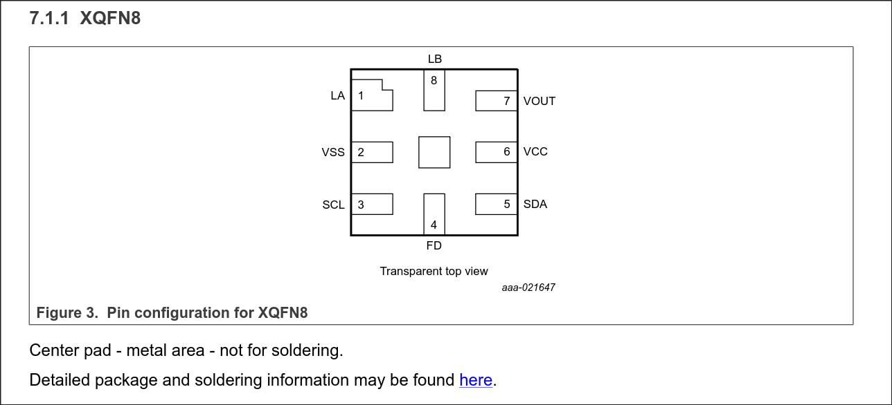

          A
          |
This is the pic of the qfn ic

ok so started the schematics , added the symbols , made a extra trace for later i2c use on the nt3 .

ah man i dont wanna go around and find the logic voltage in the datasheet , wait i dont need to actually , i2c operates at 3.3v .

Oh just found gold in the datasheet i can use the vout to power a led when i use the card , amazing right? lets do tht

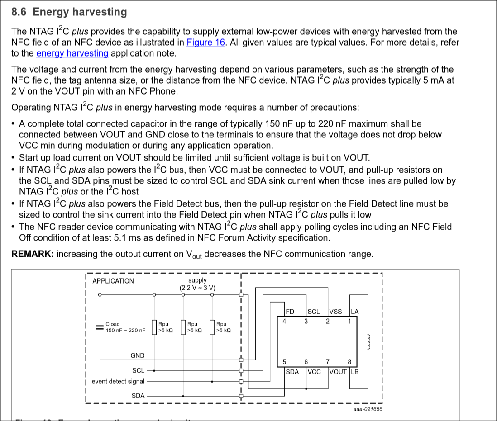
the thing i got frm datasheet .

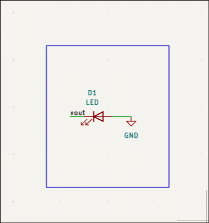

ok added a led but but its just a ultra frank design obviously i will add res and cap after measuring current and vol frm the vout .

actually we can control tht but why worry now , thts for later not now at all .

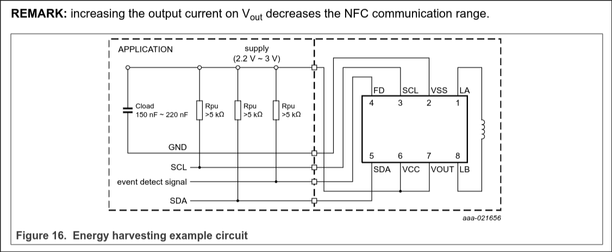 ===> this is the test circuit givn in the datasheet maybe i will use it . 

**Total time spent: 1 hours**

# Sept 26 :

Today i started readin the datasheet and placed res and caps , fixed the values accordingly to the datasheet now it looks much better .

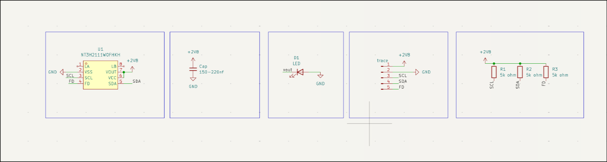

Also for lapse , reviewers plz dont mind my music .

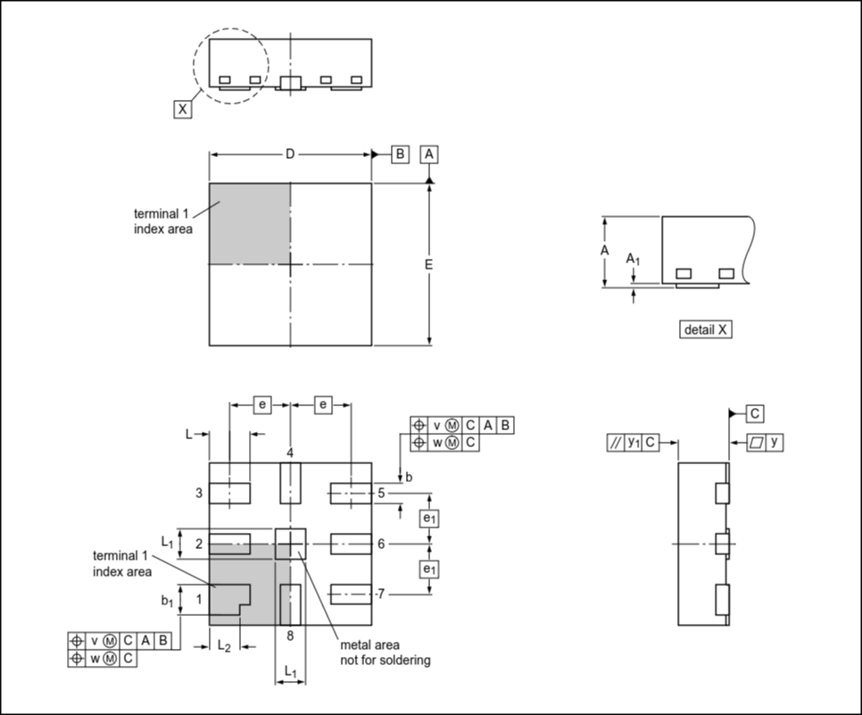

Its gonna be really hard to work on , my hot air shld do it still .

the datasheet doesnt have any desc abt the antenna , dont tell me i need to do tht myself , ah .

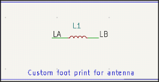

added the sym for antenna , now the real pain , custom footprint . 
got the idea how to make an antenna now just needa calculate the dimensions .

Shld i use lambda/4 for this one? 

Ok google said i shldnt use tht , i shld use 1/(2.pie(lc)^1/2) one , shld be easy . 

WAIT how the hell am i supposed to calculate the ind of the trace?

i got a good calculator , and as i am using 1 oz , it shld be 35 um , i shld verify .

ok verified but i also got a tool to make it instead of making it myself buhaha .

its `https://neurotech-hub.github.io/KiCad-Antenna-Generator/`

ok now needa find inductence .

Oh done 

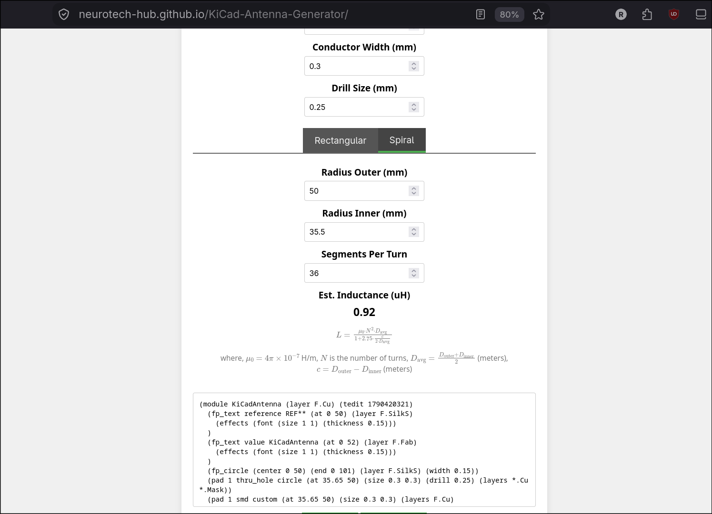

this site saved my ass , now i have the footprint , i can easily do the rest .

done lol 

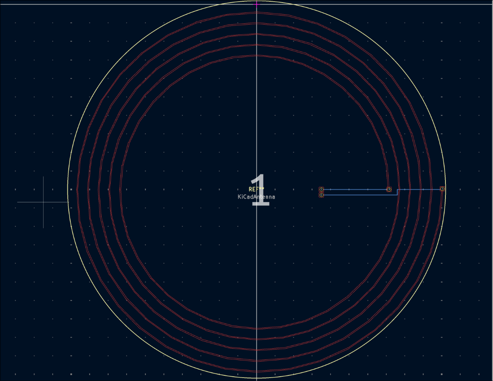

it was far easier than i thought .

i started the pcb and used the antenna footprint but after i made changes to the footprint and saved tht , now i just cant use the new footprint idk why?

ok fixed but i just realized , the footprint is way too bigger , i mistook diameter with radius ahhhhh wtf.

ah now footprint err

ok fixed eerything now time for connecting things , 

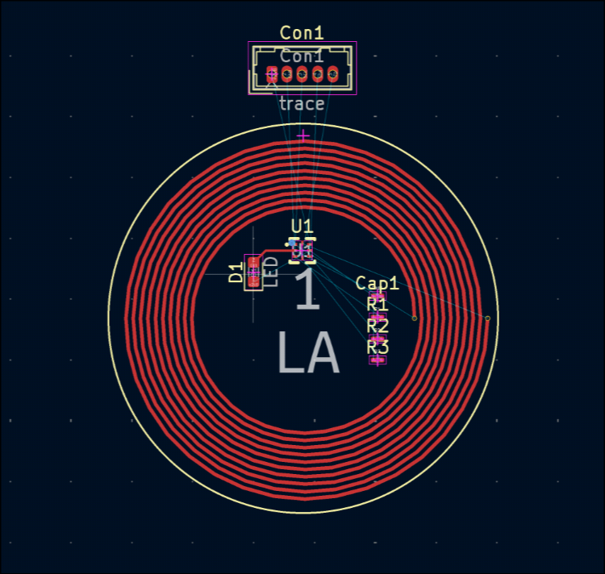

looks like the nfc tag itself is complete uf finally .

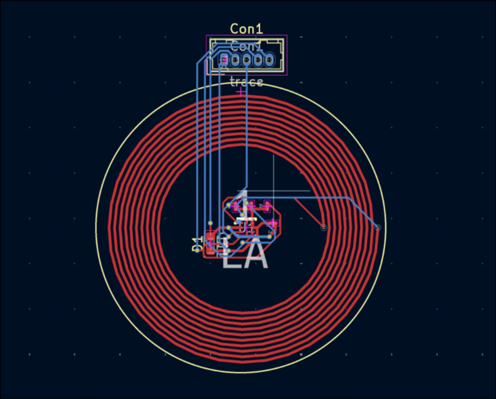

ok its done now , now i need styles on it .

ok i will do tht later 

**Total time spent: 2.5 hours**