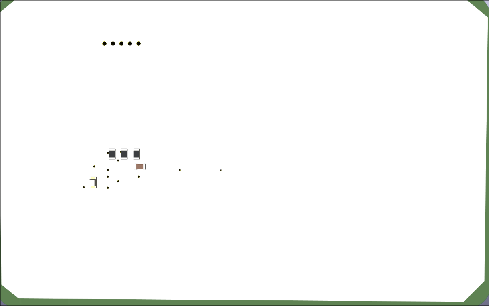

[![Contributors][contributors-shield]][contributors-url]
[![Forks][forks-shield]][forks-url]
[![Stargazers][stars-shield]][stars-url]
[![Issues][issues-shield]][issues-url]
[![Unlicense License][license-shield]][license-url]

# NFC

A basic nfc card with custom antenna .

## Design 

The integrated planar antenna harvests power from the phone's magnetic field to  light up the led placed in front side pcb layer while simltaniously doing nfc connection with phone/other device . Also i have left some traces for later i2c uses .

### Back 

### Front

## How to make your own pcb?

Check out my project's build video's on forge 

[Forge](https://forge.hackclub.com/projects/2851)

you can re use my antenna and add custom footprint for others , or you can swap my name and qr with your own :D .

## Building The nfc  

I will use pcba on jlc pcb to order it because the parts are kinda rare in india and if i order frm lcsc , it will cost me more for shipping and moq .

But if you wanna solder/rework on your own , order the parts frm given links in bom and solder the components on the designated places as cpl.xlsx says , then connect the card with your nfc enabled phone and bind a url . Or you can use a esp 32/other mpu and rewrite the eeprom with i2c , **REMINDER : USE 2.2-3v POWER SUPPLY **

detailed steps for non pcba :

- Order the components listed in the bom.
- Place the components according to the xlsx file(use jlcpcb's pcba tool to mark things up with the cpl ).
- Solder the components onto the pcb.
- Bring the completed card near an nfc phone.
- Configure the ic with the  data.

The antenna is supposed to harvest energy from the nfc field,
which is more than enough to power the led while the nfc ic communicates
with the phone or whatever nfc device youre using.

## Credits 

- > [LINK]{https://neurotech-hub.github.io/KiCad-Antenna-Generator/}

- Kicad

## Author 

me , mineself Erox aka Dipanjan  

## Bom 

# BOM 

| Designator | Comment | Footprint | Quantity | LCSC Part # | LCSC Link | Unit Price |
|---|---|---|---:|---|---|---:|
| Cap1 | 180 nf | Capacitor_SMD:C_0603_1608Metric | 1 | C519440 | https://www.lcsc.com/product-detail/C519440.html | $0.0114 |
| D1 | LED | LED_0603_1608Metric | 1 | C19171394 | https://www.lcsc.com/product-detail/C19171394.html | See LCSC |
| R1 | 5k ohm | Resistor_SMD:R_0603_1608Metric | 1 | C862232 | https://www.lcsc.com/product-detail/Chip-Resistor-Surface-Mount_YAGEO-RT0603BRE075KL_C862232.html | $0.0293 |
| R2 | 5k ohm | Resistor_SMD:R_0603_1608Metric | 1 | C862232 | https://www.lcsc.com/product-detail/Chip-Resistor-Surface-Mount_YAGEO-RT0603BRE075KL_C862232.html | $0.0293 |
| R3 | 5k ohm | Resistor_SMD:R_0603_1608Metric | 1 | C862232 | https://www.lcsc.com/product-detail/Chip-Resistor-Surface-Mount_YAGEO-RT0603BRE075KL_C862232.html | $0.0293 |
| U1 | NT3H2111W0FHKH | XQFN-8_L1.6-W1.6-P0.50-BL_NT3H2111W0FHKH | 1 | C710403 | https://www.lcsc.com/product-detail/NFC-RFID-Tags_NXP-Semiconductors-NT3H2111W0FHKH_C710403.html | $0.6224 |